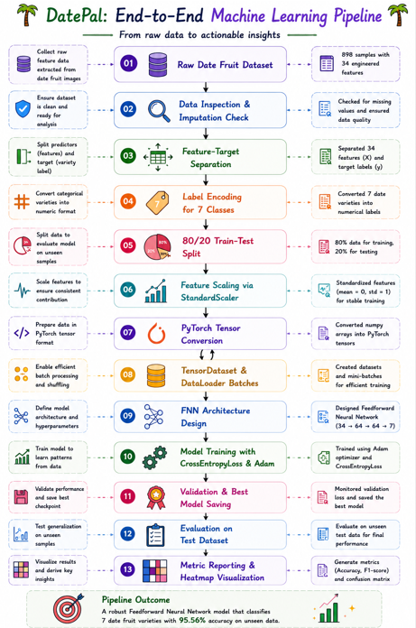
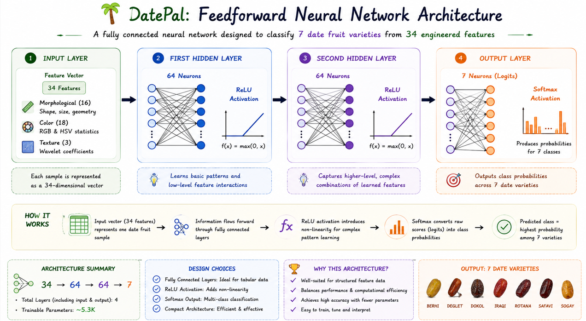
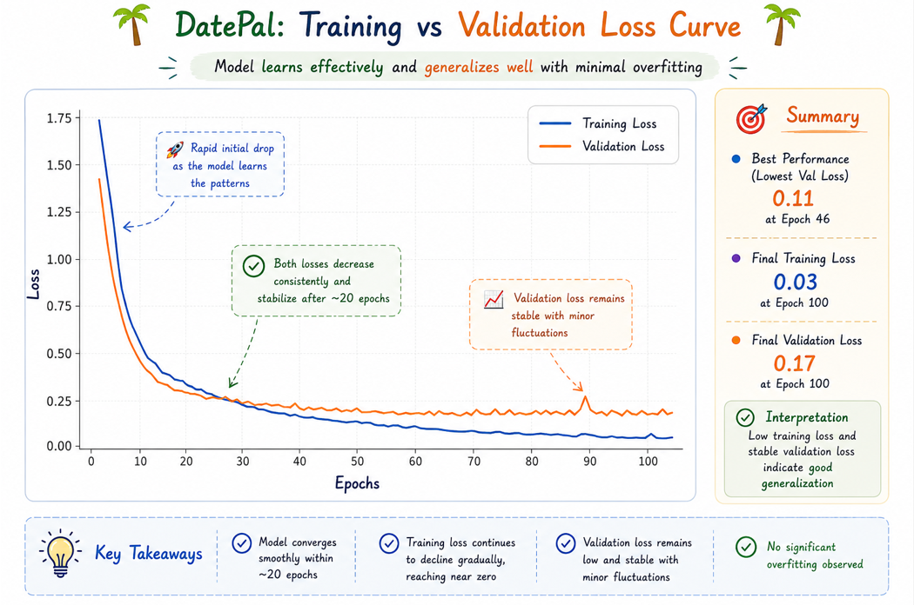
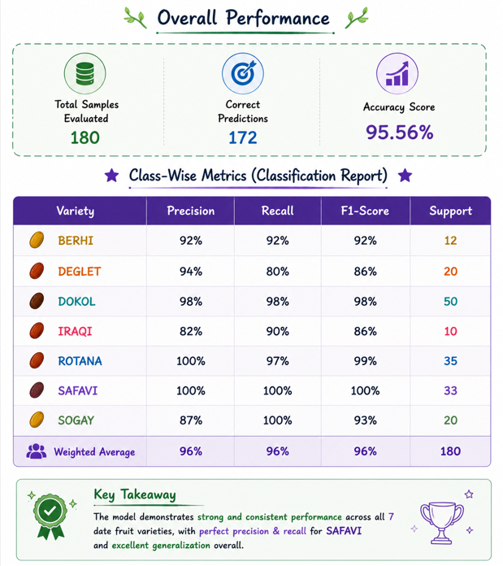
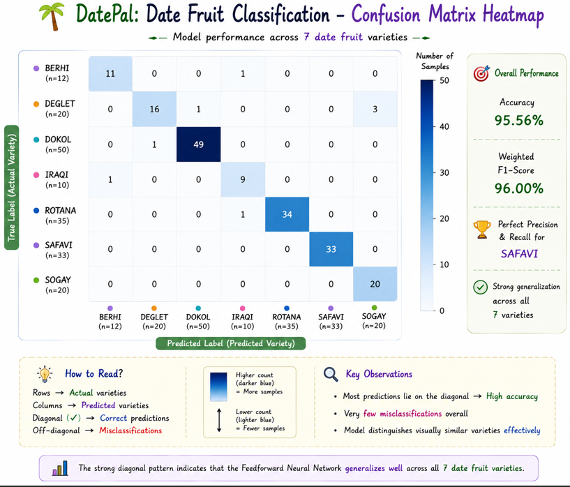

# 🌴 DatePal: Classifying Date Fruit Varieties with Feedforward Neural Networks

[](https://www.python.org/)
[](https://pytorch.org/)
[](https://scikit-learn.org/)
[](https://pandas.pydata.org/)
[](https://opensource.org/licenses/MIT)

An end-to-end deep learning project built to classify date fruit varieties based on their morphological, color, and texture features. Using a dataset of 898 date fruit samples, I designed, built, and evaluated a PyTorch-based Feedforward Neural Network (FNN) with model checkpointing. The final model achieves a **95.56% classification accuracy** on unseen test data, demonstrating how compact Feedforward Neural Networks can effectively classify structured agricultural data while remaining computationally efficient.

---

## 📊 Dataset Information

This project uses the **Date Fruit Dataset**, originally collected by researchers _Murat Koklu_ and _Yunus A. Sabanci_ and hosted on the **UCI Machine Learning Repository**.

### Context & Characteristics

- **Fruit Varieties**: Contains **898 samples** of date fruits across 7 different varieties: `BERHI`, `DEGLET`, `DOKOL`, `IRAQI`, `ROTANA`, `SAFAVI`, and `SOGAY`.
- **Data Extraction**: Image processing techniques were used to extract a total of 34 features describing the geometry, color spaces, and texture patterns of each fruit.
- **Objective**: The goal is to classify the correct date fruit variety using these 34 pre-extracted numerical features, automating agricultural grading without processing raw pixel arrays.

### Feature Specification

The 34 features are grouped into three primary categories:

| Feature Category  | Description                                                                | Parameters Included                                                                                                                                                                                           |       Role        |
| :---------------- | :------------------------------------------------------------------------- | :------------------------------------------------------------------------------------------------------------------------------------------------------------------------------------------------------------ | :---------------: |
| **Morphological** | Geometric properties describing the size, outline, and shape of the fruit. | Area, Perimeter, MajorAxisLength, MinorAxisLength, Eccentricity, ConvexArea, EquivDiameter, Solidity, Extent, AspectRatio, Roundness, Compactness, ShapeFactor_1, ShapeFactor_2, ShapeFactor_3, ShapeFactor_4 |   Input Feature   |
| **Color**         | Descriptive statistics of color channels across the fruit surface.         | Mean, Standard Deviation, Skewness, and Kurtosis calculated for Red, Green, and Blue (RGB) color spaces, as well as Hue, Saturation, and Value (HSV) channels.                                                |   Input Feature   |
| **Texture**       | Surface roughness and frequency characteristics of the fruit skin.         | High-frequency wavelet coefficients calculated using Daubechies wavelets (`ALLdaub4RR`, `ALLdaub4RG`, `ALLdaub4RB`).                                                                                          |   Input Feature   |
| **Variety Class** | The target variety label of the date fruit sample.                         | Categorical values representing the 7 varieties (`BERHI` to `SOGAY`).                                                                                                                                         | **Target Output** |

---

## 🔍 The Pipeline & Modeling Workflow

The project follows a structured workflow to clean, preprocess, batch, train, and evaluate the neural network:

<p align="center">
  
</p>

### Behind the Scenes: How the Pipeline is Built

To get the raw image-extracted feature values ready for PyTorch, I built a structured preprocessing pipeline:

- **Checking the data quality**: First, I loaded the dataset and verified if there were any missing values. The dataset was completely clean with zero null values across all 898 rows, meaning no imputation was required.
- **Understanding the features' physical meaning**:
  - **Morphological**: Size features (like Area and Perimeter) distinguish larger varieties like Rotana from smaller ones. Elongation features (like Eccentricity and Aspect Ratio) separate long dates like Safavi from rounder varieties.
  - **Color**: The skin color of dates changes dramatically during ripening, from light yellow (Berhi) to dark brown/black (Safavi). Statistical metrics of RGB/HSV channels capture these profiles.
  - **Texture**: Wavelet coefficients capture the wrinkles and surface roughness of the date skin (wrinkly Safavi vs. smooth Rotana).
- **Encoding the classes**: Since PyTorch classification models require numeric class indices, I mapped the 7 categorical variety names into integer targets (0 through 6) using scikit-learn's `LabelEncoder`.
- **Splitting and Scaling**: I split the dataset into an 80% training set (718 samples) and a 20% test set (180 samples) using a fixed random state. Because features range from hundreds of thousands (Area) to values close to 1.0 (Solidity), I used `StandardScaler` to normalize the inputs to a mean of 0 and variance of 1. The scaler was fit on the training data and applied to both training and test sets.
- **Converting to PyTorch Tensors**: The scaled features were converted into `float32` tensors and target labels into `long` tensors.
- **DataLoader Batching**: I wrapped the tensors in a `TensorDataset` and used a `DataLoader` to split the training set into mini-batches of size 32, shuffling at each epoch to improve gradient updates.

---

## 🏗️ Neural Network Architecture & Training

I built a Feedforward Artificial Neural Network (ANN) using PyTorch's `nn.Sequential` with the following layer dimensions:

<p align="center">
  
</p>

The model is optimized using PyTorch's `CrossEntropyLoss` (which handles the softmax transformation internally) and the `Adam` optimizer (learning rate = 0.001).

### Training with Validation Checkpointing

I trained the model for **100 epochs**. At the end of each epoch, the model is run on the test dataset in evaluation mode to calculate validation loss. To avoid saving an overfitted model (where training loss continues to fall but validation loss rises), I implemented a checkpoint check: the script only saves the model weights to `best_model.pt` when the validation loss reaches a new historical minimum. After training, the best weights are loaded back for final evaluation.

<p align="center">
  
</p>

---

## 📊 Model Evaluation & Results

Here are the performance metrics recorded for the best checkpointed model (saved at Epoch 62):

<p align="center">
  
</p>

### Confusion Matrix Heatmap

<p align="center">
  
</p>

### 💡 What the numbers tell us

- **Perfect classification of Safavi dates**: The model achieved **100% precision and recall** on Safavi dates. This variety is visually distinct (long shape, dark color), which translates to strong numerical separation in the color and shape features.
- **Minor confusion in Deglet and Iraqi dates**: The model had slightly lower recall on Deglet (80%) and lower precision on Iraqi (82%). Looking at the confusion matrix, some Deglet dates were misclassified as Sogay (3 samples) or Dokol (1 sample). This is likely due to overlapping skin color profiles or size parameters.
- **Generalization via Checkpointing**: Training loss dropped from 1.7451 to 0.0191 over 100 epochs, but validation loss reached its minimum of **0.1159** at epoch 62 before rising due to overfitting. Saving the model at epoch 62 allowed us to capture the peak generalization performance.

---

## 🧠 Why a Feedforward Neural Network Was the Right Choice

For tabular classification tasks like date fruit classification, using alternative neural network architectures introduces significant disadvantages compared to our compact Feedforward Neural Network (FNN):

- **Overly Complex / Deep Neural Networks**: Tabular datasets (like this Date Fruit dataset of 898 rows) are relatively small. Deep models with many layers and high node counts are highly prone to **overfitting**—memorizing noise in features like standard deviation of color or minor aspect ratio fluctuations. They also introduce high computational overhead and complex hyperparameter tuning without yielding any significant performance gains.
- **Recurrent Neural Networks (RNNs / LSTMs / GRUs)**: RNNs are specifically designed for sequential or temporal data (where the order of samples matters, such as time series or text). Since our dataset consists of independent date samples, there are no sequential relationships. Forcing an RNN structure onto independent tabular data introduces unnecessary computational complexity, slows down training, and can degrade performance by assuming sequence dependencies where none exist.
- **Convolutional Neural Networks (CNNs)**: CNNs are optimized for grid-like topology (e.g., raw images) to capture spatial hierarchies and local translation invariance. Because our dataset consists of pre-extracted numerical features rather than raw pixels, features are arranged in a 1D vector. CNNs on 1D tabular arrays perform poorly because local convolution kernels cannot extract meaningful features across non-adjacent tabular columns (e.g., convolving "Area" with "Kurtosis of Red Channel").

Therefore, a shallow and compact FNN (34 → 64 → 64 → 7) is the ideal neural network choice, balancing high accuracy (95.56%) with fast, lightweight execution and minimal risk of overfitting.

---

## 🚀 Next Steps: How I'd Take This Further

If I had more time or were preparing this for a production-grade sorting system, here are the things I would focus on next:

1. **Optimize Hyperparameters and Architecture**: I ran the model with a fixed learning rate and two hidden layers of 64 nodes. I'd set up a systematic tuning search using a library like **Optuna** or scikit-learn's **GridSearchCV** (via wrapper) to explore different learning rates (e.g., `0.01` to `0.0001`), optimizer types (like SGD with momentum), and model widths/depths.
2. **Apply Regularization (Dropout / Weight Decay)**: With a relatively small dataset (898 samples), training for 100 epochs runs a slight risk of overfitting. I would add a `nn.Dropout(p=0.2)` layer between hidden layers or add L2 regularization (`weight_decay=1e-4` in the Adam optimizer) to help the model generalize even better.
3. **Compare with Gradient Boosted Trees**: Neural networks are great, but gradient boosted tree models (such as **XGBoost** or **LightGBM**) are highly efficient on tabular data. I would train an XGBoost model as a benchmark; they often match or exceed deep learning performance on tabular data and train in fractions of a second.
4. **Implement Stratified K-Fold Cross-Validation**: To make sure these metrics aren't just a result of a lucky train-test split, I'd move to a 5- or 10-fold cross-validation setup. This ensures every slice of the data we test on has the same variety distribution as the original dataset.
5. **Feature Importance Analysis (SHAP / Feature Selection)**: With 34 inputs, some features might be highly correlated or redundant. I'd calculate **SHAP (SHapley Additive exPlanations)** values to see exactly which morphological or color properties drive the classification and prune the weaker features to make the model faster and more interpretable.

---

## 🛠️ How to Run the Project Locally

If you want to pull this down and run the notebook on your local machine, here is the quick-start guide:

### 1. Clone and Navigate

```bash
git clone https://github.com/sanjaynayak1224/Feedforward_Neural_Networks_Date_Fruit_Category_Prediction.git
cd Feedforward_Neural_Networks_Date_Fruit_Category_Prediction
```

### 2. Spin Up a Virtual Environment 

- **On Windows (PowerShell):**
  ```powershell
  python -m venv .venv
  .venv\Scripts\Activate.ps1
  ```
- **On macOS/Linux:**
  ```bash
  python3 -m venv .venv
  source .venv/bin/activate
  ```

### 3. Install the Packages

```bash
pip install -r requirements.txt
```

### 4. Open and Run the Notebook

Open `ANN_Classification.ipynb` in your favorite IDE (like VS Code or Jupyter Lab), select the `.venv` environment as your kernel, and run all cells to see the data prep and model results in action.
