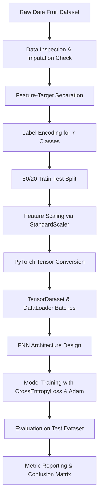

# 🌴 DatePal: Classifying Date Fruit Varieties with Feedforward Neural Networks

[](https://www.python.org/)
[](https://pytorch.org/)
[](https://scikit-learn.org/)
[](https://pandas.pydata.org/)
[](https://opensource.org/licenses/MIT)

An end-to-end deep learning project built to classify date fruit varieties based on their genetic, morphological, color, and texture features. Using a dataset of 898 date fruit samples, I designed, built, and trained a PyTorch-based Feedforward Neural Network (FNN) that achieves **94.44% accuracy** on unseen test data—providing a reliable model for automated agricultural sorting and food quality verification.

---

## 🔍 The Pipeline & Modeling Workflow

The project follows a structured workflow to clean, preprocess, batch, train, and evaluate the neural network. Here is the general structure:



### Behind the Scenes: How the Pipeline is Built

To get the raw image-extracted feature values ready for PyTorch, I built a structured preprocessing pipeline:

* **Checking the data quality**: I loaded the date dataset and verified if there were any missing values. The dataset was completely clean with zero null values across all 898 rows and 35 columns, so no imputation was required.
* **Understanding the features**: The dataset contains 34 morphological, color, and texture features extracted from images of dates:
  * *Morphological*: Area, Perimeter, Major/Minor Axis length, Eccentricity, Convex Area, Solidity, Extent, Aspect Ratio, Roundness, and shape factors.
  * *Color*: Mean, standard deviation, skewness, and kurtosis values calculated from the Red, Green, and Blue (RGB) color spaces.
  * *Texture*: High-frequency information extracted using Daubechies wavelets (`ALLdaub4RR`, `ALLdaub4RG`, `ALLdaub4RB`).
  * The target variable `Class` contains the 7 varieties: `BERHI`, `DEGLET`, `DOKOL`, `IRAQI`, `ROTANA`, `SAFAVI`, and `SOGAY`.
* **Encoding the classes**: Since PyTorch classifications require integer targets, I mapped the 7 categorical class names into numeric labels (0 through 6) using scikit-learn's `LabelEncoder`.
* **Splitting and Scaling**: I split the dataset into an 80% training set (718 samples) and a 20% test set (180 samples). Because neural networks converge faster and perform better when features are on a similar scale (features like Area are in the hundreds of thousands, while solidity is close to 1.0), I used `StandardScaler` to fit and scale the training data, and then applied those same parameters to scale the test data.
* **Converting to PyTorch Tensors**: Since PyTorch requires numeric inputs as tensor objects, I converted the scaled numpy arrays into `float32` tensors for features and `long` tensors for target labels.
* **DataLoader Batching**: I wrapped the tensors in a `TensorDataset` and used a `DataLoader` to split the training set into mini-batches of size 32, shuffling at each epoch to prevent the model from memorizing the order of samples.

---

## 🏗️ Neural Network Architecture & Training

I built a Feedforward Artificial Neural Network (ANN) using PyTorch's `nn.Sequential` with the following structure:
* **Input Layer**: Accepts the 34 normalized environmental features.
* **First Hidden Layer**: 64 nodes with a `ReLU` activation function to capture non-linear relationships.
* **Second Hidden Layer**: 64 nodes with a `ReLU` activation.
* **Output Layer**: 7 nodes (fully connected linear layer) corresponding to the raw logits of the 7 varieties.

I compiled the model using PyTorch's `CrossEntropyLoss` (which handles softmax internally) to measure performance and the `Adam` optimizer to adjust network weights during backpropagation.

### Training Details
I ran the training loop for **100 epochs**. The loss steadily converged, dropping from a baseline of **1.7451** at the first epoch to **0.0211** at epoch 100.

---

## 📊 Model Evaluation & Results

Here are the performance metrics I recorded for the model:

### Overall Performance
* **Total Samples Evaluated**: 180
* **Correct Predictions**: 170
* **Accuracy Score**: **94.44%**

### Class-Wise Metrics (Classification Report)

| Variety | Precision | Recall | F1-Score | Support |
| :--- | :---: | :---: | :---: | :---: |
| **BERHI** | 92% | 92% | 92% | 12 |
| **DEGLET** | 81% | 85% | 83% | 20 |
| **DOKOL** | 100% | 92% | 96% | 50 |
| **IRAQI** | 82% | 90% | 86% | 10 |
| **ROTANA** | 100% | 97% | 99% | 35 |
| **SAFAVI** | 100% | 100% | 100% | 33 |
| **SOGAY** | 87% | 100% | 93% | 20 |
| **Weighted Average** | **95%** | **94%** | **95%** | **180** |

### Confusion Matrix
```text
[[11  0  0  1  0  0  0]
 [ 0 17  0  0  0  0  3]
 [ 0  4 46  0  0  0  0]
 [ 1  0  0  9  0  0  0]
 [ 0  0  0  1 34  0  0]
 [ 0  0  0  0  0 33  0]
 [ 0  0  0  0  0  0 20]]
```

### 💡 What the numbers tell us
* **Exceptional classification of Safavi dates**: The model achieved **100% precision and recall** on Safavi dates. This variety is visually distinct (long shape, dark color), which translates to strong numerical separation in the color and shape features.
* **Minor confusion in Deglet and Iraqi dates**: The model had slightly lower precision on Deglet (81%) and Iraqi (82%) varieties. Looking at the confusion matrix, some Deglet dates were incorrectly classified as Sogay, and one Iraqi date was misclassified as Berhi. This is likely due to overlapping color histograms or roundness ranges.
* **Highly generalized features**: Achieving 94.44% test accuracy on a relatively small dataset without complex convolutional networks demonstrates that the morphology, color space statistics, and Daubechies wavelet textures extracted from the raw images provide a powerful signature for agricultural sorting.

---

## 🚀 Next Steps: How I'd Take This Further

If I had more time or were preparing this for a production sorting system, here are the 5 things I'd tackle next to boost performance:

1. **Optimize Hyperparameters and Architecture**: I ran the model with a fixed learning rate and two hidden layers of 64 nodes. I'd set up a systematic tuning search using a library like **Optuna** or scikit-learn's **GridSearchCV** (via wrapper) to explore different learning rates (e.g., `0.01` to `0.0001`), optimizer types (like SGD with momentum), and model widths/depths.
2. **Apply Regularization (Dropout / Weight Decay)**: With a relatively small dataset (898 samples), training for 100 epochs runs a slight risk of overfitting. I would add a `nn.Dropout(p=0.2)` layer between hidden layers or add L2 regularization (`weight_decay=1e-4` in the Adam optimizer) to help the model generalize even better.
3. **Compare with Gradient Boosted Trees**: Neural networks are great, but gradient boosted tree models (such as **XGBoost** or **LightGBM**) are highly efficient on tabular data. I would train an XGBoost model as a benchmark; they often match or exceed deep learning performance on tabular data and train in fractions of a second.
4. **Implement Stratified K-Fold Cross-Validation**: To make sure these metrics aren't just a result of a lucky train-test split, I'd move to a 5- or 10-fold cross-validation setup. This ensures every slice of the data we test on has the same variety distribution as the original dataset.
5. **Feature Importance Analysis (SHAP / Feature Selection)**: With 34 inputs, some features might be highly correlated or redundant. I'd calculate **SHAP (SHapley Additive exPlanations)** values to see exactly which morphological or color properties drive the classification and prune the weaker features to make the model faster and more interpretable.

---

## 🛠️ How to Run the Project Locally

If you want to pull this down and run the notebook on your local machine, here is the quick-start guide:

### 1. Clone and Navigate
```bash
git clone <repository-url>
cd Feedforward_Neural_Networks_Date_Fruit_Category_Prediciton
```

### 2. Spin Up a Virtual Environment
* **On Windows (PowerShell):**
  ```powershell
  python -m venv .venv
  .venv\Scripts\Activate.ps1
  ```
* **On macOS/Linux:**
  ```bash
  python3 -m venv .venv
  source .venv/bin/activate
  ```

### 3. Install the Packages
```bash
pip install -r requirements.txt
```

### 4. Open and Run the Notebook
Open `ANN_Classification.ipynb` in your favorite IDE (like VS Code or Jupyter Lab), select the `.venv` environment as your kernel, and run all cells to see the data prep and model results in action.
